# SSIS → Microsoft Fabric — Reference Migration

A worked, end-to-end example of moving a classic SQL Server Integration
Services (SSIS) workload onto **Microsoft Fabric**, driven by the
[`ssis-migration`](https://github.com/markgar/ssis-migration) Copilot skill.

> If you have `.ispac` / `.dtsx` packages today and you are evaluating
> Fabric, this repo shows you exactly what the migration looks like — the
> commands, the generated specs, the deployed artifacts, and the parity
> checks that prove the new pipelines produce the same numbers as the old
> ones.

---

## 0. End-to-end flow at a glance

```mermaid
%%{init: {'theme':'dark', 'themeVariables': {
  'primaryColor':'#142033',
  'primaryTextColor':'#e6edf3',
  'primaryBorderColor':'#00B7C3',
  'lineColor':'#9aa6bc',
  'secondaryColor':'#1a2335',
  'tertiaryColor':'#0a0e1a',
  'fontFamily':'Segoe UI, Inter, sans-serif'
}}}%%
flowchart LR
    subgraph SRC["🖥️  Azure VM"]
        SQL["SQL Server 2022<br/>+ SSIS runtime"]
        ISPAC["📦 .ispac / .dtsx<br/>packages"]
        SQL --> ISPAC
    end

    subgraph SKILL["🧠  ssis-migration skill<br/>(GitHub Copilot)"]
        AN["ssis-analyzer<br/>(DTSX → JSON)"]
        DA["dacpac-analyzer<br/>(.bacpac → JSON)"]
        SW["spec-writer<br/>(→ Markdown IR)"]
        AN --> SW
        DA --> SW
    end

    SPECS["📑 Shared spec set<br/>CONSTITUTION + per-table"]

    subgraph WH["🏛️  Path A · Fabric Warehouse"]
        TSQL["T-SQL: CREATE TABLE<br/>MERGE · stored procs"]
        PIPE["Fabric Data Pipeline<br/>Copy + ForEach + SP"]
    end

    subgraph LH["🌊  Path B · Fabric Lakehouse"]
        PYSPARK["PySpark notebook"]
        DELTA["Delta tables on OneLake<br/>SparkSQL views"]
        PYSPARK --> DELTA
    end

    WS["🟪 Fabric Workspace<br/>ws-ssis2fabric-demo"]

    ISPAC -->|export| AN
    ISPAC -->|sqlpackage| DA
    SW --> SPECS
    SPECS -->|Flavor A| TSQL
    TSQL --> PIPE
    SPECS -->|Flavor B| PYSPARK
    PIPE --> WS
    DELTA --> WS

    classDef src    fill:#142033,stroke:#2899F5,color:#e6edf3
    classDef skill  fill:#1a1530,stroke:#B084CC,color:#e6edf3
    classDef spec   fill:#0d1b22,stroke:#00B7C3,color:#e6edf3
    classDef wh     fill:#0c2226,stroke:#00B7C3,color:#e6edf3
    classDef lh     fill:#1a1530,stroke:#B084CC,color:#e6edf3
    classDef ws     fill:#19132b,stroke:#742774,color:#e6edf3,font-weight:bold

    class SQL,ISPAC src
    class AN,DA,SW skill
    class SPECS spec
    class TSQL,PIPE wh
    class PYSPARK,DELTA lh
    class WS ws
```



*One source. One spec set. Two Fabric targets. Validated end-to-end.*

---

## 1. What this is

This repository is a **reference demo** that takes a small but realistic
SSIS project (three packages loading a star schema — `DimCustomer`,
`DimProduct`, `FactOrders`) and migrates it to Microsoft Fabric in **two
flavors at the same time**:

* **Flavor A — Fabric Warehouse** with T-SQL `CREATE TABLE` / `MERGE` /
  stored procedures, deployed against a Fabric Warehouse and orchestrated
  with a single `EXEC dw.usp_RunAll`.
* **Flavor B — Fabric Lakehouse** with a PySpark / Spark SQL notebook
  writing Delta tables to OneLake.

Both flavors start from the **same source artifacts** (`.ispac` + two
`.bacpac` files), the **same generated migration specs**, and end with
**byte-identical aggregates**: 500 customers across 20 countries, 100
products summing to $23,199.50, and 2,000 orders totalling
**$2,039,990.00**. The point of the demo is to show that the SSIS-shaped
ETL can be faithfully re-expressed in either Fabric backend with no drift
in business numbers.

---

## 2. Why two flavors?

Fabric is happy to host both styles, and most enterprises end up with a
mix. Pick the flavor that matches the team that will own the pipeline.

| Choose **Fabric Warehouse** (Flavor A) when… | Choose **Fabric Lakehouse** (Flavor B) when… |
|---|---|
| Your team's muscle memory is T-SQL, stored procedures, and `MERGE`. | Your team is data-engineering / data-science first and lives in notebooks. |
| The downstream consumer is a Power BI semantic model with Direct Lake / DirectQuery. | The downstream consumers are ML pipelines, Spark jobs, or external engines reading Delta directly. |
| You want a single, governed SQL endpoint and SQL-style RBAC. | You want open Delta on OneLake, accessible from anywhere that speaks Delta. |
| Existing SSIS logic is mostly `Execute SQL` tasks and OLE DB sources/destinations. | Existing SSIS logic includes Script Components, complex transforms, or unstructured / semi-structured data. |
| Operational story is "DBAs operate the warehouse". | Operational story is "platform engineers operate notebooks + pipelines". |

Both are first-class in Fabric, both bill against the same capacity, and
both write to OneLake under the hood. You can also do **both** — many
teams land raw data in the Lakehouse and curate into the Warehouse.

---

## 3. Architecture at a glance

```
                       ┌──────────────────────────────┐
                       │  Source: SQL Server + SSIS   │
                       │  .ispac + .dtsx packages     │
                       │  Source DB + Target DB       │
                       └───────────────┬──────────────┘
                                       │
                                       │  sqlpackage /Action:Export
                                       │  copy .ispac out of SSISDB
                                       ▼
                       ┌──────────────────────────────┐
                       │   migration/source/          │
                       │   *.ispac  +  *.bacpac       │
                       └───────────────┬──────────────┘
                                       │
                                       │  ssis-migration Copilot skill
                                       │  ├── ssis-analyzer   (.dtsx → JSON)
                                       │  ├── dacpac-analyzer (.bacpac → JSON)
                                       │  └── spec-writer     (→ Markdown specs)
                                       ▼
                       ┌──────────────────────────────┐
                       │   migration/specs/           │
                       │   CONSTITUTION + per-table   │
                       │   spec (one source of truth) │
                       └───────┬──────────────┬───────┘
                               │              │
              Flavor A         │              │         Flavor B
         (T-SQL build pass)    │              │    (PySpark build pass)
                               ▼              ▼
              ┌────────────────────────┐  ┌──────────────────────────┐
              │  Fabric Warehouse      │  │  Fabric Lakehouse        │
              │  schemas: stg/dim/fact │  │  Delta tables in OneLake │
              │  stored procedures     │  │  PySpark notebook        │
              │  EXEC dw.usp_RunAll    │  │  RunNotebook job         │
              └───────────┬────────────┘  └─────────────┬────────────┘
                          │                              │
                          └───────────────┬──────────────┘
                                          ▼
                       ┌──────────────────────────────┐
                       │   Validation (tests/)        │
                       │   row counts + aggregates    │
                       │   parity across all three    │
                       └──────────────────────────────┘
```

---

## 3a. How the conversion works

The `ssis-migration` skill does not "translate line-by-line". It treats the
SSIS project as XML, lifts it into a typed **intermediate representation
(IR)**, and then emits target-shaped artifacts deterministically. The same
IR drives both Fabric build passes.

### Source side — what's actually in an SSIS package

A `.dtsx` is XML. The skill parses three things out of it:

* **Control Flow** — `Execute SQL Task`, `Data Flow Task`, `Foreach Loop`,
  `Script Task`, `Sequence`, precedence constraints.
* **Data Flow components** — `OLE DB Source/Destination`, `Flat File
  Source`, `Derived Column`, `Lookup`, `Conditional Split`, `Aggregate`,
  `Sort`, `Merge`/`Union All`, `Script Component`.
* **Project metadata** — connection managers, project params, package
  params, variables, expressions.

The companion `.bacpac` (via `dacpac-analyzer`) contributes the **schema
side**: table DDL, indexes, FKs, defaults, stored procs, views.

### What the skill emits

```
.dtsx + .bacpac
        │
        ▼     (ssis-analyzer / dacpac-analyzer)
   typed JSON IR (control flow graph + dataflow lineage + schema)
        │
        ▼     (spec-writer)
   migration/specs/   ← single source of truth (Markdown)
        │
        ├──► T-SQL pass  → migration/warehouse/*.sql + pipeline JSON
        └──► PySpark pass → migration/lakehouse/*.ipynb + Delta paths
```

The Markdown specs are runtime-agnostic. Each table spec carries:
**source query, key columns, SCD policy, derived columns, lookups, target
shape**. Either target can be regenerated from the same spec.

### Side-by-side mapping table

| SSIS component | Fabric Warehouse (T-SQL) | Fabric Lakehouse (SparkSQL / PySpark) |
|---|---|---|
| **OLE DB Source** | `Copy Activity` in Data Pipeline → staging table | `spark.read.jdbc(...)` or `spark.read.parquet(...)` |
| **OLE DB Destination** | `INSERT … SELECT` / `MERGE` from staging | `df.write.format("delta").mode("...").save(path)` |
| **Flat File Source** | `Copy Activity` (delimited file → table) | `spark.read.option("header", true).csv(path)` |
| **Derived Column** | `CASE WHEN … THEN … END` in projection | `df.withColumn("c", when(...).otherwise(...))` |
| **Lookup** | `LEFT JOIN` against dim staging | `df.join(dim, "key", "left")` |
| **Conditional Split** | `WHERE` clauses / branched INSERTs | `df.filter(...)` per branch |
| **Aggregate** | `GROUP BY` / window functions | `df.groupBy(...).agg(...)` |
| **Sort** | `ORDER BY` (or `ROW_NUMBER()` for surrogate keys) | `df.orderBy(...)` |
| **Merge / Union All** | `UNION ALL` in select | `df1.unionByName(df2)` |
| **Execute SQL Task** | Stored procedure (`CREATE PROCEDURE`) | `spark.sql("...")` cell |
| **Foreach Loop** | Pipeline `ForEach` activity | Python `for` over a list |
| **Script Task / Component** | Stored proc, or pipeline notebook step | Native PySpark cell |
| **Connection Manager** | Linked service in pipeline | Spark conf / OneLake path |
| **Project / Package Param** | Pipeline parameter | Notebook parameter cell |

### Worked example — a Derived Column three ways

**SSIS Derived Column** (the expression the package author actually wrote):

```text
Tier = TotalSpend > 10000 ? "Platinum"
     : TotalSpend >  5000 ? "Gold"
     :                      "Standard"
```

**Target A — Fabric Warehouse (T-SQL)** — emitted into the staging-to-dim
stored procedure:

```sql
SELECT
    CustomerKey,
    CustomerName,
    TotalSpend,
    CASE
        WHEN TotalSpend > 10000 THEN 'Platinum'
        WHEN TotalSpend >  5000 THEN 'Gold'
        ELSE                         'Standard'
    END AS Tier
FROM stg.Customer;
```

**Target B — Fabric Lakehouse (PySpark + SparkSQL)** — emitted into the
notebook cell that builds `DimCustomer`:

```python
from pyspark.sql.functions import col, when

df = (spark.read.format("delta").load(f"{lh}/stg_Customer")
       .withColumn(
           "Tier",
           when(col("TotalSpend") > 10000, "Platinum")
           .when(col("TotalSpend") >  5000, "Gold")
           .otherwise("Standard"),
       ))

df.write.format("delta").mode("overwrite").save(f"{lh}/DimCustomer")
```

Or, equivalently, as SparkSQL on a registered view:

```sql
CREATE OR REPLACE TABLE DimCustomer USING DELTA AS
SELECT
    CustomerKey,
    CustomerName,
    TotalSpend,
    CASE
        WHEN TotalSpend > 10000 THEN 'Platinum'
        WHEN TotalSpend >  5000 THEN 'Gold'
        ELSE                         'Standard'
    END AS Tier
FROM stg_Customer;
```

Same business rule, three surfaces — the skill keeps semantics identical
across them, which is what makes the byte-identical aggregate parity
possible.

---

## 4. Prerequisites

Before you start, you'll need:

### On the source side

* A SQL Server (2016 or newer) hosting your SSIS project, with the
  packages you want to migrate either deployed to **SSISDB** or available
  as `.ispac` / `.dtsx` files on disk.
* Network access from your workstation to the SQL instances that back the
  packages (so you can run `sqlpackage` against them).

### On your workstation

* **PowerShell 7+** (the scripts in this repo are Windows PowerShell
  flavoured but run on PS 7 cross-platform).
* **Azure CLI**, signed in to the tenant that owns your Fabric capacity:

  ```powershell
  az login
  az account set --subscription "<your-subscription-id>"
  ```

* **SqlPackage CLI** for bacpac export:

  ```powershell
  dotnet tool install -g microsoft.sqlpackage
  $env:PATH = "$env:USERPROFILE\.dotnet\tools;$env:PATH"
  sqlpackage /version    # confirm
  ```

* **GitHub Copilot CLI** (or **VS Code with GitHub Copilot Chat**) so you
  can install and invoke the `ssis-migration` skill.
* The **`ssis-migration` skill** itself:

  ```bash
  # Inside Copilot CLI:
  /marketplace add https://github.com/markgar/ssis-migration
  /plugins install ssis-analyzer
  /plugins install dacpac-analyzer
  /plugins install spec-writer
  ```

  The plugins are pure-Python stdlib — no `pip install` required.

* **Python 3.10+** (used by the analyzer plugins and the validation
  scripts under `tests/`).
* **`pyodbc`** if you intend to use the load workaround under
  `migration/warehouse/_load_via_insert.py`:
  `pip install pyodbc pyarrow pandas`.

### On Microsoft Fabric

* A **Fabric tenant** with a **capacity** (an **F2 SKU** is enough for
  this demo; F-SKUs can be paused when idle to control cost).
* Permissions:
  * **Workspace creator** in your Fabric tenant (or an existing workspace
    you can deploy into).
  * **Contributor** on the Azure subscription that owns the capacity, if
    you'll be provisioning the capacity from scratch.
  * **Entra ID** sign-in that can acquire tokens for
    `https://database.windows.net/` (Warehouse), `https://api.fabric.microsoft.com/`
    (control plane) and `https://storage.azure.com/` (OneLake DFS).

---

## 5. Step-by-step migration walkthrough

These are the steps you'll repeat for your own packages. Each step
references the corresponding artifact in this repo so you can see what
"good" looks like.

### Step 1 — Export the SSIS and database artifacts

Produce three files per project you want to migrate:

1. The SSIS project as `.ispac`. If your packages are deployed to
   `SSISDB`, export from SSMS (right-click project → *Export*) or from a
   build of the SSDT solution. If you only have loose `.dtsx` files, you
   can assemble them into a minimal `.ispac` ZIP (this repo does exactly
   that — see `migration/MIGRATION.md` for the recipe).
2. A `.bacpac` of every **source** database the packages read from.
3. A `.bacpac` of every **target** database the packages write to (used
   as your baseline of "truth").

```powershell
sqlpackage /Action:Export `
  /SourceServerName:"<your-sql-server>,1433" `
  /SourceDatabaseName:"<your-source-db>" `
  /SourceUser:"<your-sql-admin>" /SourcePassword:"<your-password>" `
  /SourceTrustServerCertificate:True /SourceEncryptConnection:True `
  /TargetFile:migration\source\<your-source-db>.bacpac /Quiet:True
```

This repo's artifacts live under
[`migration/source/`](./migration/source/):
`SsisDemo.ispac` (7.5 KB), `SalesSrc.bacpac` (96 KB), `SalesDW.bacpac`
(39 KB).

### Step 2 — Install the `ssis-migration` skill in Copilot

In the Copilot CLI (or VS Code Copilot Chat):

```
/marketplace add https://github.com/markgar/ssis-migration
/plugins install ssis-analyzer
/plugins install dacpac-analyzer
/plugins install spec-writer
```

Verify with `/plugins list` — you should see three plugins installed.

### Step 3 — Run `ssis-analyzer` against each `.dtsx`

`ssis-analyzer` parses DTSX XML and exposes ~20 subcommands: control
flow, data flows, precedence constraints, Execute SQL bodies, Script
Task code, connection managers, parameters, column lineage. You can
invoke it through Copilot:

```
@ssis-analyzer overview migration/source/Load_Customers.dtsx
@ssis-analyzer extract-sql --json migration/source/Load_Customers.dtsx
@ssis-analyzer list-data-flows --json migration/source/Load_Orders.dtsx
```

Or run the Python script directly for batch use:

```powershell
python <skill-path>/plugins/ssis-analyzer/scripts/analyze.py `
  migration/source/Load_Customers.dtsx overview --json `
  > migration/source-analysis/Load_Customers/overview.json
```

See [`migration/source-analysis/`](./migration/source-analysis/) for the
three packages' worth of JSON dumps from this demo.

### Step 4 — Run `dacpac-analyzer` against each `.bacpac`

`dacpac-analyzer` does the same job for SQL schema: tables (with
columns, types, nullability, constraints, indexes), views, stored
procedures (with body + parameters), functions, PK/FK/unique/check/default
constraints, sequences, roles, permissions.

```
@dacpac-analyzer overview migration/source/SalesSrc.bacpac
@dacpac-analyzer list-tables --json migration/source/SalesDW.bacpac
@dacpac-analyzer extract-sql --json migration/source/SalesDW.bacpac
```

See [`migration/dacpac-analysis/`](./migration/dacpac-analysis/) for the
nine JSON dumps per database from this demo.

> **Heads-up:** in the current plugin build, `list-foreign-keys` is not
> available — use `list-constraints` or `table-detail`; FKs show up
> there.

### Step 5 — Generate the migration spec set with `spec-writer`

`spec-writer` is a prose-only Copilot skill: it reads the analyzer
output and produces a directory of Markdown specs — one per fact / dim
table, plus a `CONSTITUTION.md` for project-level facts and a
`README.md` index.

In Copilot chat:

```
Write migration specs from migration/source/SsisDemo.ispac
and migration/source/SalesSrc.bacpac + migration/source/SalesDW.bacpac
into migration/specs/
```

Each numbered spec contains: SSIS lineage, source tables (SQL types,
nullability, notes), source extraction logic (exact T-SQL), staging
schema, destination table (with SQL Server and Delta column names),
column mapping, SCD2 merge logic, watermark strategy, PySpark source
query, testing strategy.

See [`migration/specs/`](./migration/specs/) for the canonical example:

* [`CONSTITUTION.md`](./migration/specs/CONSTITUTION.md) — project
  facts shared by every spec.
* [`01-prereqs-and-source-schema.md`](./migration/specs/01-prereqs-and-source-schema.md)
* [`02-dim-customer.md`](./migration/specs/02-dim-customer.md) — SCD2
  pattern.
* [`03-dim-product.md`](./migration/specs/03-dim-product.md) — CSV +
  Script Component transform.
* [`04-fact-orders.md`](./migration/specs/04-fact-orders.md) — fact
  load with lookup join.

The specs are **runtime-agnostic** for the heavy lifting. Each spec has
a *Flavor A — Warehouse DDL* block and a *Flavor B — Delta column
mapping* block, and either build pass starts from the same file.

### Step 6 — Provision the Fabric workspace, warehouse and lakehouse

You need three Fabric items: a workspace, a warehouse, and a lakehouse.
This repo's [`fabric/deploy.ps1`](./fabric/deploy.ps1) is a reference
script that:

1. Looks up your Fabric capacity GUID via `GET /v1/capacities` (note:
   the **capacity GUID is not the same as the Azure ARM resource ID**).
2. Creates a workspace (`POST /v1/workspaces`) and binds it to the
   capacity.
3. Creates the warehouse (`POST /v1/workspaces/{wid}/warehouses`).
4. Creates the lakehouse (`POST /v1/workspaces/{wid}/lakehouses`).
5. Writes the resulting IDs to `fabric/workspace.json` for the rest of
   the pipeline to consume.

```powershell
.\fabric\deploy.ps1 `
  -CapacityName "<your-capacity-name>" `
  -WorkspaceName "<your-workspace-name>" `
  -WarehouseName "wh_<your-name>" `
  -LakehouseName "lh_<your-name>"
```

Resulting `fabric/workspace.json` (anonymised here, real IDs in your
own deploy):

```json
{
  "workspaceId": "<your-workspace-id>",
  "workspaceName": "<your-workspace-name>",
  "capacityId":  "<your-capacity-id>",
  "warehouseId": "<your-warehouse-id>",
  "warehouseSqlEndpointServer": "<your-warehouse-endpoint>.datawarehouse.fabric.microsoft.com",
  "lakehouseId": "<your-lakehouse-id>",
  "lakehouseOneLakePath": "abfss://<your-workspace-name>@onelake.dfs.fabric.microsoft.com/<your-lakehouse-name>.Lakehouse"
}
```

### Step 7a — Flavor A: deploy the Warehouse build

The five generated T-SQL files in
[`migration/warehouse/`](./migration/warehouse/) deploy in order:

| File | Purpose |
|---|---|
| `00_schemas.sql` | `CREATE SCHEMA stg, dim, fact` |
| `01_stg_tables.sql` | Staging tables (one per source table) |
| `02_dim_fact_tables.sql` | `dim.*` and `fact.*` final tables |
| `03_load_procedures.sql` | One procedure per entity (SCD2 MERGE for dims, lookup-join INSERT for the fact) |
| `04_load_orchestrator.sql` | `dw.usp_RunAll` — chains the procedures in dependency order |

Deploy with the included script:

```powershell
.\migration\warehouse\deploy.ps1 -WorkspaceJson .\fabric\workspace.json
```

Then load:

```powershell
# Lands parquet into stg.* via pyodbc multi-row INSERTs
python .\migration\warehouse\_load_via_insert.py
# Build dim.* and fact.* from stg.*
sqlcmd -S <your-warehouse-endpoint>.datawarehouse.fabric.microsoft.com `
       -d wh_<your-name> -G -Q "EXEC dw.usp_RunAll;"
```

> ⚠ **Fabric Warehouse T-SQL surface differs from SQL Server.** The
> generated DDL already accounts for it, but if you hand-author T-SQL
> against a Fabric Warehouse keep in mind:
>
> * **No `NVARCHAR`** — use `VARCHAR` (UTF-8 by default).
> * **No `IDENTITY`** historically; verify support before relying on it.
>   This demo derives surrogate keys via `ROW_NUMBER()` over a stable
>   ordering.
> * **No `DEFAULT NEWID()`** — generate GUIDs at load time.
> * **No `DEFAULT` for most built-in functions** (`SYSUTCDATETIME()`
>   etc.). Materialise values in the `INSERT`.
> * **No `CHECK` constraints.**
> * **`MERGE` is supported** — SCD2 close-off-then-insert translates
>   cleanly.

> ⚠ **`COPY INTO` from OneLake gotcha.** When `COPY INTO` is issued
> against a Fabric Warehouse over a `sqlcmd`-passed AAD token, the
> warehouse cannot OBO-exchange that token for an OneLake token and
> fails with `Msg 13840 — Access token couldn't be fetched for storage
> path '...'`. The workaround used here is
> [`migration/warehouse/_load_via_insert.py`](./migration/warehouse/_load_via_insert.py):
> read each parquet file with pyarrow / pandas, push 200 rows per
> `INSERT ... VALUES` via `pyodbc`. At demo scale that completes in
> ~1 minute. For production, prefer a Fabric Data Pipeline copy
> activity (which uses workspace identity) or set up a managed
> identity that the warehouse can use directly.

### Step 7b — Flavor B: deploy the Lakehouse build

The Lakehouse build is a single notebook,
[`migration/lakehouse/migration.ipynb`](./migration/lakehouse/migration.ipynb),
which:

1. Reads the source parquet files from
   `abfss://<workspace>@onelake.dfs.fabric.microsoft.com/<lakehouse>.Lakehouse/Files/raw/`.
2. Applies the same transformations the SSIS Script Component applied
   (e.g. `UPPER(Sku)`, derive `margin_category` from `price`).
3. Builds `dim_*` Delta tables with surrogate keys via Spark window
   functions.
4. Builds `fact_*` Delta tables joining to the dimensions.
5. Writes each table with
   `.option("path", "abfss://.../Tables/<name>").saveAsTable("<name>")`
   so it doesn't depend on a "default lakehouse" being set.

Upload and run via the Fabric REST API
([`migration/lakehouse/upload-notebook.ps1`](./migration/lakehouse/upload-notebook.ps1)):

```powershell
.\migration\lakehouse\upload-notebook.ps1 -WorkspaceJson .\fabric\workspace.json
```

What that script does:

* `POST /v1/workspaces/{wid}/items` with the notebook payload
  base64-encoded as `definition.parts[0].payload` and
  `payloadType: "InlineBase64"`.
* Patches `metadata.dependencies.lakehouse.default_lakehouse` to your
  lakehouse GUID before upload so the notebook is bound to the right
  lakehouse.
* Triggers a run via
  `POST /v1/workspaces/{wid}/items/{nbId}/jobs/instances?jobType=RunNotebook`
  and polls the `Location`-returned instance until status flips from
  `InProgress` to `Completed` (~60 s once the Spark session warms up).

> ⚠ **OneLake binary upload gotcha.** Some `fabric-onelake_upload_file`
> wrappers return HTTP 400 on binary uploads. Use the **OneLake DFS
> REST** API directly (`PUT ?resource=file` → `PATCH ?action=append` →
> `PATCH ?action=flush`) with an AAD token scoped to
> `https://storage.azure.com/`. That sequence also auto-creates parent
> directories, so a separate "create directory" call is unnecessary.

> ⚠ **Parquet timestamp gotcha.** pandas/pyarrow default to
> nanosecond-precision timestamps (`INT64 TIMESTAMP(NANOS)`). Fabric
> Spark refuses to read them. Always pass
> `coerce_timestamps='us', allow_truncated_timestamps=True` when
> writing parquet for OneLake.

### Step 8 — Validate

Both flavors are only as good as the parity check that proves they
produce the right numbers. The validator in
[`tests/validate.py`](./tests/validate.py) queries all three locations
(source, Warehouse, Lakehouse) and compares row counts and aggregates.
The output template is
[`tests/validation-report.md`](./tests/validation-report.md).

```powershell
python .\tests\validate.py `
  --workspace-json .\fabric\workspace.json `
  --baseline .\out\baseline\target-rowcounts.json `
  --out .\tests\validation-report.md
```

Per-location row counts are persisted under `out/baseline/`:

* `source-rowcounts.json` — counts from the source SQL Server.
* `target-rowcounts.json` — counts + `CHECKSUM_AGG` from the on-prem DW.
* `warehouse-rowcounts.json` — counts from the Fabric Warehouse.
* `lakehouse-rowcounts.json` — counts from the Fabric Lakehouse Delta
  tables.
* `aggregate-validation.json` — raw aggregate query results.

The validator passes when row counts match exactly and decimal sums are
within ±0.01 across all three locations.

---

## 6. What's in this repo

```
ssis2fabric/
├── migration/
│   ├── source/             # The starting artifacts: .ispac + two .bacpac
│   ├── source-analysis/    # ssis-analyzer JSON outputs, one folder per .dtsx
│   ├── dacpac-analysis/    # dacpac-analyzer JSON outputs, one folder per .bacpac
│   ├── specs/              # spec-writer output — CONSTITUTION + per-table specs
│   ├── warehouse/          # Flavor A — generated T-SQL + deploy + load script
│   ├── lakehouse/          # Flavor B — generated PySpark notebook + upload script
│   ├── source-to-onelake/  # Helper: turn source CSVs into Parquet for OneLake
│   ├── MIGRATION.md        # Hands-on log of how this demo was built
│   └── RECON.md            # Notes on the ssis-migration skill (plugins, commands)
├── fabric/                 # Fabric workspace/warehouse/lakehouse provisioning
│   ├── deploy.ps1          # Create workspace + warehouse + lakehouse via REST
│   ├── destroy.ps1         # Tear down
│   ├── workspace.json      # IDs of the deployed workspace items
│   └── notebook-template.ipynb
├── infra/                  # Optional: Azure VM that hosts the demo source SQL/SSIS
│   ├── deploy.ps1          # Spin up the VM (SQL 2022 + SSIS) and seed it
│   ├── destroy.ps1
│   └── connection.json     # VM topology (IPs / hostnames anonymised in YOUR copy)
├── tests/                  # End-to-end validation harness
│   ├── validate.py
│   └── validation-report.md
├── out/                    # Run artifacts (rowcounts, parquet exports, baselines)
│   ├── baseline/           # JSON baselines per location
│   ├── raw/                # CSV + Parquet source data
│   └── ispac-staging/      # ZIP-shaped staging for the .ispac build
└── ssis/                   # The original SSIS source: .dtsx, .params, SQL, CSV
```

---

## 7. Known limitations and gotchas

Things that cost time the first time around — if you read nothing else
in this README, read this section.

* **Fabric Warehouse T-SQL ≠ SQL Server T-SQL.** No `NVARCHAR`, no
  historical `IDENTITY`, no `DEFAULT NEWID()`, no `DEFAULT` on most
  built-in functions, no `CHECK` constraints. Plan to materialise
  defaults at load time and to derive surrogate keys with
  `ROW_NUMBER()`.

* **`COPY INTO` from OneLake under sqlcmd-passed AAD token fails** with
  `Msg 13840 Access token couldn't be fetched for storage path '...'`.
  The warehouse can't OBO-exchange the caller's
  `database.windows.net` token for a OneLake token. For demo scale,
  fall back to `pyodbc` + multi-row `INSERT VALUES` (see
  `_load_via_insert.py`). For production, use a Fabric Data Pipeline
  copy activity or wire up a workspace identity the warehouse can use
  directly.

* **OneLake binary upload via some MCP wrappers returns HTTP 400.** Use
  the **OneLake DFS REST** API (`PUT ?resource=file` → `PATCH
  ?action=append` → `PATCH ?action=flush`) with an AAD token scoped to
  `https://storage.azure.com/`. It also auto-creates parent
  directories.

* **Fabric capacity ARM resource ID ≠ Fabric capacity GUID.** When you
  bind a workspace to a capacity, you need the **Fabric** GUID returned
  by `GET /v1/capacities`, not the Azure ARM resource ID. They look
  similar but they are not interchangeable.

* **`list-foreign-keys` is not in the current `dacpac-analyzer`.** Use
  `list-constraints` or `table-detail` — FKs show up as constraints.

* **SCD2 from SSIS Script Components (C#) translates cleanly** to both
  T-SQL `MERGE` (close current rows → insert new rows) and Spark
  `MERGE INTO` / `DataFrame.write.mode("overwrite")`. The pattern is
  in `migration/specs/02-dim-customer.md`. The hard part of SCD2 is
  *agreement on the natural key and the change-detection columns*, not
  the SQL syntax.

* **Hand-authored DTSX can parse and still fail `dtexec`.** The
  analyzer is permissive (good for migration: it tells you what the
  package is *meant* to do), but `dtexec` is strict. Common gaps in
  hand-authored DTSX:
  * `OLE DB Source` missing `OpenRowset` even when
    `AccessMode=SqlCommand`.
  * `Script Component` requires a precompiled binary built by SSDT —
    not just the C# source.
  * `Flat File Source` requires `FileNameColumnName` (even if empty).
  * `SourceCode` array property needs an `arrayElementCount` attribute.
  If you're synthesising DTSX for testing, fix these up front or use
  T-SQL equivalents to populate the source-side baseline.

* **SparkSQL string literals must be single-quoted.** Double-quoted
  strings can be treated as identifiers under the default config and
  silently break `CASE` expressions.

* **Fabric notebook job failures surface as
  `System_Cancelled_Session_Statements_Failed`** with no detail. To get
  the real Python traceback, wrap each cell in `try` / `except` and
  persist `traceback.format_exc()` to a known OneLake `Files/` path —
  the REST monitoring API does not expose cell stdout.

* **The Lakehouse SQL analytics endpoint lags Delta writes by 10–20
  seconds.** A newly written Delta table may return
  `Invalid object name` on the first `SELECT`. Retry.

---

## 8. Results from this demo

After both flavors deploy and load, the parity check across all three
locations is:

| Table | Source DW | Fabric Warehouse | Fabric Lakehouse | Aggregate |
|---|---|---|---|---|
| `DimCustomer` | 500 rows | **500** ✅ | **500** ✅ | 20 distinct countries |
| `DimProduct` | 100 rows | **100** ✅ | **100** ✅ | `SUM(Price)` = **$23,199.50** |
| `FactOrders` | 2,000 rows | **2,000** ✅ | **2,000** ✅ | `SUM(TotalAmount)` = **$2,039,990.00** |

All aggregate sums are **byte-identical** across the Fabric Warehouse
and the Fabric Lakehouse — no engine-rounding tolerance was required.
Surrogate key values are not expected to match across engines (each
engine assigns its own) and are intentionally not part of the parity
check; natural keys (`*_id`) line up exactly.

The full report (with the date-range aggregates and the per-location
methodology notes) is in
[`tests/validation-report.md`](./tests/validation-report.md).

---

## 9. Get started

You now have everything you need to run the same playbook against your
own SSIS project. Three links to bookmark:

* **This reference repo** — clone it, browse `migration/specs/` for the
  pattern, copy `fabric/deploy.ps1` and `migration/warehouse/deploy.ps1`
  as starting points.
* **The `ssis-migration` Copilot skill** —
  <https://github.com/markgar/ssis-migration>. Install via
  `/marketplace add` in the Copilot CLI.
* **Microsoft Fabric documentation** —
  <https://learn.microsoft.com/fabric/>. In particular: *Fabric
  Warehouse → T-SQL surface area*, *Lakehouse → Delta tables*, *OneLake
  → shortcuts and the DFS REST API*, and *Fabric REST API → Items and
  Jobs*.

Happy migrating. If you find a gotcha that isn't on the list in
§7, send it back — every team that follows you will benefit.

---

## Presentation

A DECKIO presentation deck covering this end-to-end story (problem,
both Fabric paths, validation, lessons) lives in [`deck/`](./deck/).
To view it locally:

```powershell
cd deck
npm install
npm run dev
```

Then open <http://localhost:5173/>.
